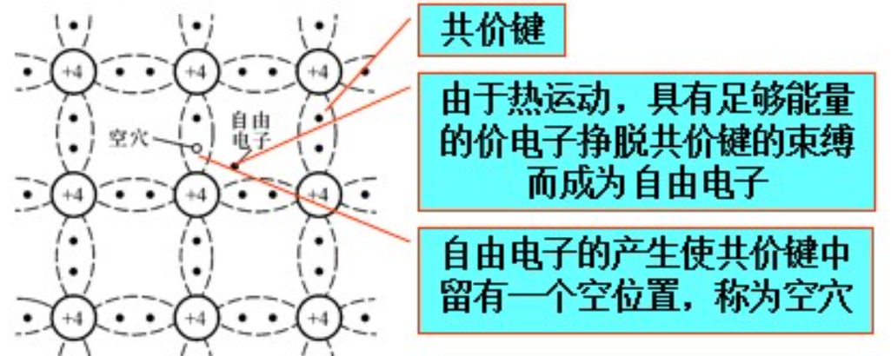
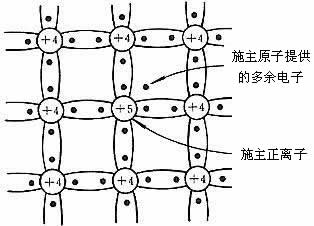
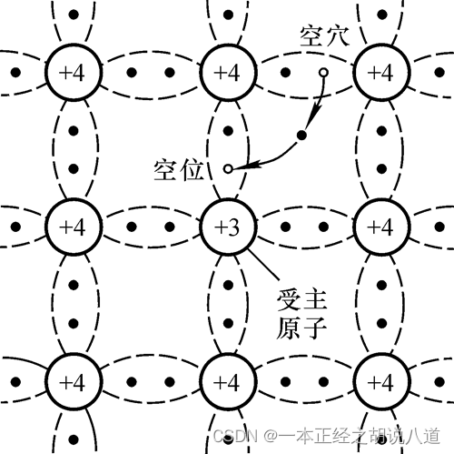

# 1.1 半导体基础知识

> 半导体器件是构成电子电路的基本元件

---

## 1.1.1 本征半导体

### 一、半导体

半导体：导电性介于导体与绝缘体之间的物质

| 特性               | 导体（金属等）     | 绝缘体（惰性气体、橡胶等） | 半导体（四价元素）                    |
| ------------------ | ------------------ | -------------------------- | ------------------------------------- |
| 价电子             | 1～2 个（低价）    | ≥7 个或满壳层（高价）      | 4 个                                  |
| 禁带宽度 Eg        | 0 eV（重叠）       | ≥5 eV                      | 0.7～1.5 eV（Si:1.12 eV，Ge:0.66 eV） |
| 载流子浓度 (300 K) | 10²²～10²³ cm⁻³    | <10³ cm⁻³                  | 10¹⁰～10¹⁶ cm⁻³（本征约 10¹⁰ cm⁻³）   |
| 电阻率 (300 K)     | 10⁻⁸～10⁻⁶ Ω·cm    | 10¹⁴～10²² Ω·cm            | 10²～10⁹ Ω·cm                         |
| 电导机制           | 自由电子           | 几乎无自由载流子           | 电子+空穴（本征或掺杂）               |
| 温度影响           | 电阻↑（晶格散射↑） | 电阻略↓（但仍极高）        | 电阻↓（本征激发↑，少子剧增）          |
| 掺杂效应           | 几乎不变           | 几乎不变                   | 浓度、类型可控（P/N 型）              |
| 常见材料           | Cu、Al、Ag、Na     | 惰性气体、橡胶、玻璃、石英 | Si、Ge、GaAs、C（金刚石结构）         |
| 应用               | 导线、电极         | 封装、绝缘支撑、护套       | 二极管、晶体管、集成电路              |

**本征半导体**：纯净的晶体结构的半导体

### 二、本征半导体的晶体结构

### 三、本征半导体中的两种载流子

当价带中的一个电子被激发（如受热、光照或掺杂）离开原位，留下一个**电子空位**，这个空位即称为**空穴**。

- 

### 四、本征半导体中载流子的浓度

**本征激发**：半导体在热激发下产生自由电子和空穴对的现象

**复合**：自由电子在运动的过程中如果与空穴相遇就会填补空穴，使两者同时消失

**动态平衡**：在一定温度下，本征激发所产生的自由电子和空穴对，与复合的自由电子与空穴对数目相等

本征半导体载流子的浓度为

​									$n_{i}=p_{i}=K_{i}T^{\frac{3}{2}}e^{\frac{-E_{GO}}{(2kT)}}$

| 符号     | 名称         | 定义                                     | 常用单位   |
| -------- | ------------ | ---------------------------------------- | ---------- |
| $n_i$    | 本征电子浓度 | 本征半导体中单位体积内的导带电子数       | cm⁻³       |
| $p_i$    | 本征空穴浓度 | 本征半导体中单位体积内的价带空穴数       | cm⁻³       |
| $K_i$    | 本征浓度系数 | 与材料有效态密度、普适常数有关的综合常数 | cm⁻³ K⁻³/² |
| $T$      | 绝对温度     | 晶格热力学温度                           | K          |
| $E_{GO}$ | 0 K 禁带宽度 | 绝对零度时导带底与价带顶的能量差         | eV         |
| $k$      | 玻尔兹曼常数 | $1.380649\times10^{-23}$ J·K⁻¹           | J·K⁻¹      |

- 本征半导体的导电性能很差，且与环境温度密切相关

## 1.1.2 杂质半导体

在本征半导体中掺入少量合适的杂质元素，便可得到**杂质半导体**

### 一、N型半导体

**N型半导体**：在纯净的硅晶体中掺入五价元素

N型半导体中，自由电子的浓度大于空穴的浓度，故称自由电子为**多数载流子**，空穴为**少数载流子**；简称前者为**多子**，后者为**少子**，由于杂质原子可以提供电子，故称之为**施主原子**

N型半导体主要靠自由电子导电，掺入的杂质越多，自由电子的浓度越高，导电性能也就越强

### 二、P型半导体

**P型半导体**：在纯净的硅晶体中掺入三价元素

P型半导体中，自由电子的浓度小于空穴的浓度，故称自由电子为**少数载流子**，空穴为**多数载流子**，由于杂质原子中的空位可以吸收电子，故称之为**受主原子**

## 1.1.3 PN结

**PN结**：采用不同的掺杂工艺，将P型半导体和N型半导体制作在同一块硅片上

**PN结具有单向导电性**

### 一、PN结的形成

### 二、PN结的单向导电性

1. PN结外加正向电压时处于导通状态
2. PN结外加反向电压时处于截止状态